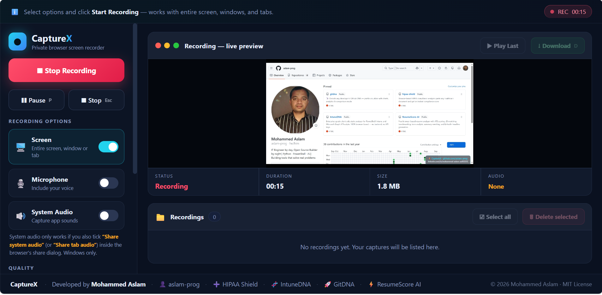
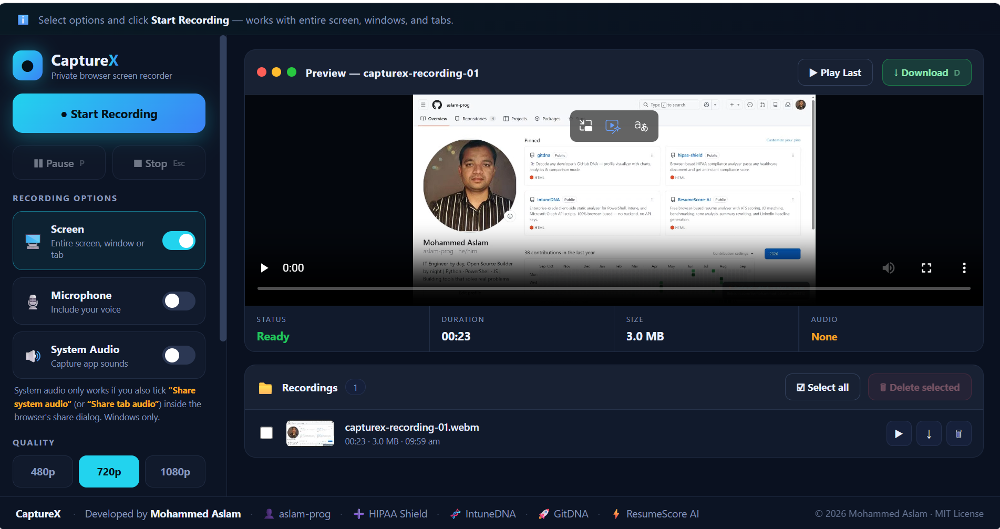

# 🎬 CaptureX

**Enterprise-grade browser-based screen recorder for recording screens, windows, browser tabs, and audio directly in your browser.**

CaptureX is a modern screen recording solution that supports screen, window, and browser tab capture with microphone recording, system audio capture, recording management, playback, and downloads. All processing happens locally in your browser, giving you complete control over your recordings without relying on external services or software installation

---

## 🚀 Live Demo

➡️ [Launch CaptureX](https://aslam-prog.github.io/capturex/)

No login. No account. No data sent anywhere. Open CaptureX and start recording instantly in your browser.

---

## 📸 Screenshots

### Playback and Recording Library

  

### Live Recording

  

---

## ✨ Features

### 🎥 Flexible Screen Recording

- Record the entire screen
- Record a specific application window
- Record an individual browser tab
- Preview the active recording in real time
- Pause and resume recordings
- Stop recording from CaptureX or the browser sharing controls
- Choose from 480p, 720p, and 1080p quality presets

### 🎙️ Audio Capture

- Record microphone audio
- Capture supported system or browser-tab audio
- Record microphone and system audio together
- Display the audio sources actually included in the recording
- Show a clear warning when system audio was requested but not shared by the browser

> **System audio note:** When sharing a browser tab, enable **Share tab audio**. When sharing the entire screen on a supported Windows browser, enable **Share system audio**. A single application window may not provide an audio track.

### 📁 Recording Management

- Keep multiple recordings during the current browser session
- View automatically generated recording thumbnails
- Preview any recording directly in CaptureX
- See recording duration, file size, and creation time
- Download recordings individually
- Delete individual recordings
- Select multiple recordings for deletion
- Select or clear all recordings
- Receive confirmation before deletion

### 🎨 Modern User Experience

- Professional dark interface
- Responsive sidebar and workspace layout
- Live recording status and timer
- Current recording size indicator
- Audio-source status indicator
- Built-in playback controls
- Clear recording, paused, ready, enabled, and disabled states
- No installation or account setup required

### ⌨️ Keyboard Shortcuts

| Shortcut | Action |
|---|---|
| `Space` | Start or stop recording |
| `P` | Pause or resume recording |
| `D` | Download the current recording |
| `Esc` | Stop recording |

---

## 🔒 Privacy and Local Processing

CaptureX is designed to run entirely inside your browser.

- No backend servers
- No cloud uploads
- No user accounts
- No software installation
- No data collection
- No third-party video processing
- Local recording, playback, and file generation
- Local watermark rendering

Your recordings remain on your device unless you choose to download and share them.

---

## 📋 How to Use

### 1. Choose Recording Options

- Keep **Screen** enabled
- Enable **Microphone** if you want to include your voice
- Enable **System Audio** if you want to capture supported computer or browser-tab sound
- Select 480p, 720p, or 1080p
- Optionally enter a custom file name

### 2. Start Recording

1. Select **Start Recording**
2. Choose an entire screen, application window, or browser tab
3. Enable the browser audio-sharing option when system or tab audio is required
4. Begin your activity

### 3. Control the Recording

- Select **Pause** to temporarily pause capture
- Select **Resume** to continue
- Select **Stop** when the recording is complete

### 4. Preview and Manage Recordings

After stopping:

- Preview the captured video
- Download the current recording
- Play any recording from the library
- Select one or more recordings
- Delete unwanted recordings

---

## 🔊 System Audio Guidance

System audio availability depends on the selected sharing source, browser, and operating system.

For the most reliable results:

- To capture browser audio, share a browser tab and enable **Share tab audio**
- To capture supported computer audio on Windows, share the entire screen and enable **Share system audio**
- Do not assume that sharing a single application window will include that application's sound
- Check the **Audio** status in CaptureX after recording starts to confirm what is actually being captured

If the browser does not provide an audio track, CaptureX continues recording the screen and displays a warning.

---

## 💾 Recording Storage

Recordings are held temporarily in browser memory during the current session.

- Download important recordings before refreshing or closing the page
- Refreshing the page clears the in-session recording library
- Deleting a recording removes it from the current session
- CaptureX does not upload or retain a copy of your videos

---

## 🌟 Use Cases

CaptureX is useful for:

- Product demonstrations
- Software walkthroughs
- Technical documentation
- Troubleshooting evidence
- Issue reproduction
- Knowledge-base content
- Training recordings
- Internal presentations
- Support handovers
- Browser and application tutorials

---

## 🖥️ Browser Support

CaptureX is intended for current desktop versions of:

- Microsoft Edge
- Google Chrome
- Mozilla Firefox

Recording and audio-sharing capabilities can vary by browser, operating system, and selected sharing source.

---

## 🧬 Other Projects

### 🛡️ HIPAA Shield

Browser-based healthcare document compliance analyzer covering HIPAA Privacy, Security, Breach Notification, and Business Associate Agreement requirements.

[Open HIPAA Shield](https://aslam-prog.github.io/hipaa-shield)

### 🧬 IntuneDNA

Enterprise-grade client-side static analyzer for PowerShell, Intune, and Microsoft Graph scripts.

[Open IntuneDNA](https://aslam-prog.github.io/IntuneDNA)

### 🚀 GitDNA

GitHub profile analytics and intelligence project.

[View GitDNA on GitHub](https://github.com/aslam-prog/gitdna)

### ⚡ ResumeScore AI

Browser-based resume analysis and scoring project.

[View ResumeScore AI on GitHub](https://github.com/aslam-prog/ResumeScore-AI)

---

## 👨‍💻 Developed By

**Mohammed Aslam**

- [GitHub profile](https://github.com/aslam-prog)
- [LinkedIn profile](https://www.linkedin.com/in/mohammed-aslam-aa903312/)
- Email: `uniqueehubs@gmail.com`

---

## 📄 License

CaptureX is released under the MIT License.

Copyright © 2026 Mohammed Aslam

See the `LICENSE` file for the complete license text.

---

## ⭐ Support the Project

If CaptureX is useful to you:

- Star the repository
- Share the live application
- Report issues with clear reproduction steps
- Suggest practical improvements
- Explore the other projects listed above

---

  <strong>CaptureX</strong> 
  Developed by Mohammed Aslam 
  Secure, private, browser-based screen capture

